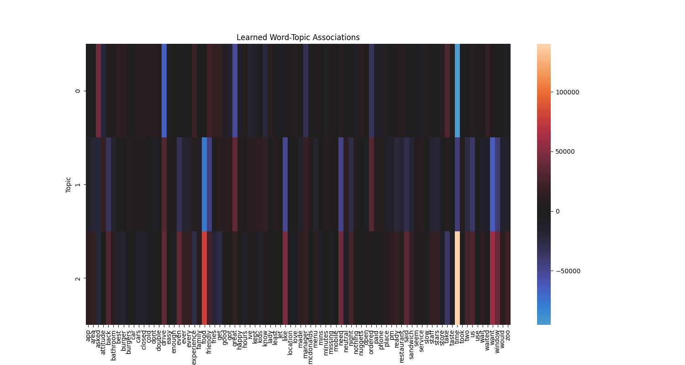
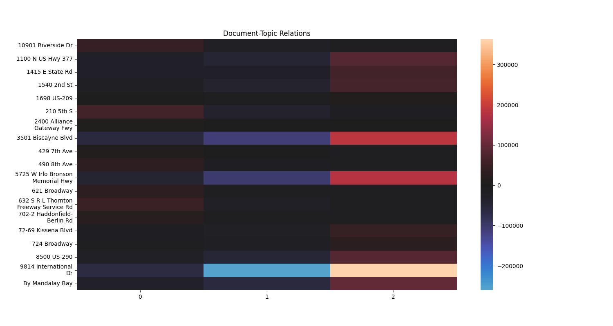

# Mini-Project: Latent Dirichlet Allocation from Scratch
- [LDA Paper](https://www.jmlr.org/papers/volume3/blei03a/blei03a.pdf)
- [Dummy Data Creation and Quick Analysis Notebook](notebooks/manip_mcdonalds.ipynb)
- [Implementation](lda/lda.py)
- [Example with topic-word visualisation](lda/test_lda.py)

## Usage
To see a heatmap of topics and their associated words in the example corpus and model
run the following:
```
pip install requirements.txt
python lda/test_lda.py
```

Results are not great, but an interesting first pass.

## Test Outcome

